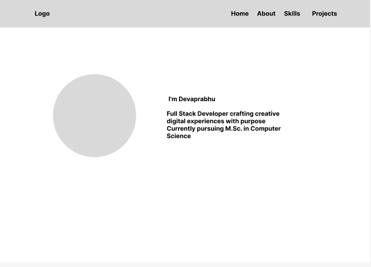

## Portfolio Landing Page

A modern, responsive portfolio website built with Tailwind CSS and a fully mobile-responsive design.

---

## Features

- Responsive Design: mobile and tablet devices
- Mobile Navigation: Hamburger menu for mobile devices

---

## Wireframes

## 

## Future Enhancements

- Add JavaScript for enhanced interactivity
- Implement dark mode toggle

### Live link

[View Live Project](https://deva-p-stack.github.io/portfolio/index.html)

---

## Author

- **Devaprabhu p**
- Email: [devap677@gmail.com](mailto:devap677@gmail.com)
- GitHub: [github.com/deva-p-stack](https://github.com/deva-p-stack)

---

## Acknowledgement:

Special thanks to [Anbuselvan Rocky](https://github.com/anburocky3) for his valuable mentorship.

---

## References

[Official Tailwind CSS Documentation](https://tailwindcss.com/docs/installation/using-vite)
